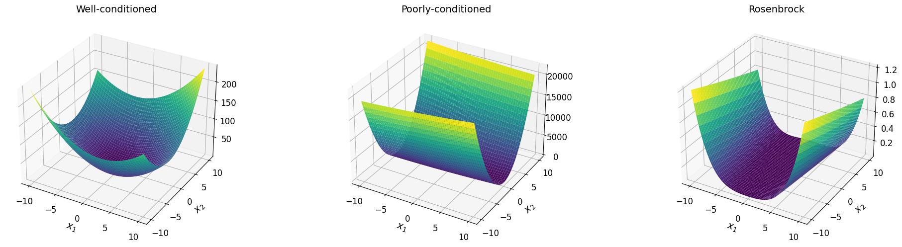
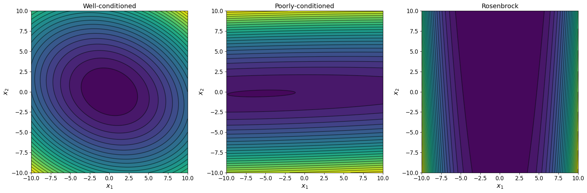

# Модификации градиентного спуска

## Рассматриваемые функции
Исследование выполнено в следующих функциях:
- хорошо обусловленная (µ ≃ 1) двумерная квадратичная функция

$$\begin{equation}
    f(x_1, x_2) = 0.8 x_1^2 + 0.4 x_1 x_2 + 1.2 x_2^2;
\end{equation}$$

- плохо обусловленная (µ > 10) двумерная квадратичная функция

$$\begin{equation}
    f(x_1, x_2) = 2 x_1^2 -10 x_1 x_2 + 205 x_2^2 + 20 x_1 + 30 x_2 + 23;
\end{equation}$$

- функция Розенброка

$$\begin{equation}
    f(x_1, x_2) = (1 - x_1)^2 + 100 (x_2 - x_1^2)^2.
\end{equation}$$

Функции и их градиенты заданы в [functions_under_study.py](functions/functions_under_study.py).

Графики функций построены в [plots.ipynb](plots.ipynb).

## Результаты исследования
- [Траектории методов на графике линий уровня](trajectories.md)
- [Зависимости от выбранной точности](descent.md)
- [Зависимости от заданной размерности и числа обусловленности квадратичных функций](general_function_optimization.md)

## Выводы

- Метод сопряженных градиентов в случае минимизации квадратичной функции сходится всего за M-шагов (не более).

## Справка
### Квадратичная функция двух аргументов

$$\begin{equation}
    f(x_1, x_2) = a_{11} x_1^2 + (a_{12} + a_{21}) x_1 x_2 + a_{22} x_2^2 + b_1 x_1 + b_2 x_2 + c
\end{equation}$$

в векторной форме записи:

$$\begin{equation}
    f(x_1, x_2) = \vec{x} A \vec{x} + B \vec{x} + c,
\end{equation}$$

где $A$ − квадратная матрица размера $M=2$,

$$\begin{equation}
   B = [b_1, b_2],
\end{equation}$$

$$\begin{equation}
   \vec{x} = \begin{bmatrix}
        x_1 \\
        x_2
    \end{bmatrix}
\end{equation}$$

$c$ − вещественное число.

### Функция Розенброка

$$\begin{equation}
    f(x_1, x_2) = (a - x_1)^2 + b (x_2 - x_1^2)^2.
\end{equation}$$

Минимум функции имеет место при ${(x_1, x_2)=(a, a^2)}$, причем ${f(a, a^2) = 0}$.

В большинстве случаев принимают ${a = 1}$, ${b = 100}$. Тогда минимум функции расположен в точке ${(1, 1)}$.

## Reference
1. [Matthew D. Zeiler. ADADELTA: An Adaptive Learning Rate Method, 2012](https://arxiv.org/abs/1212.5701)
1. [Adam: A Method for Stochastic Optimization, 2014](https://arxiv.org/abs/1412.6980)