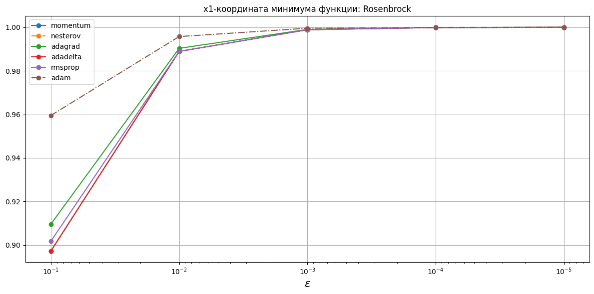
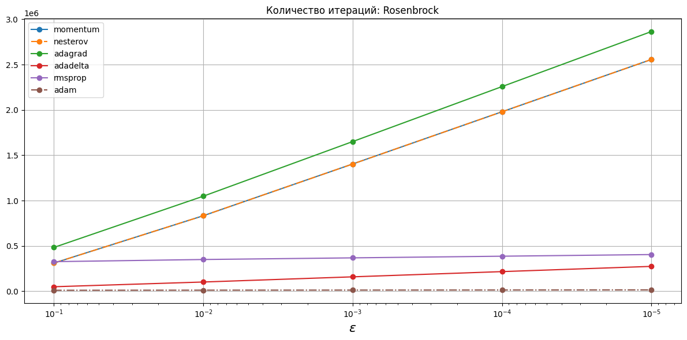
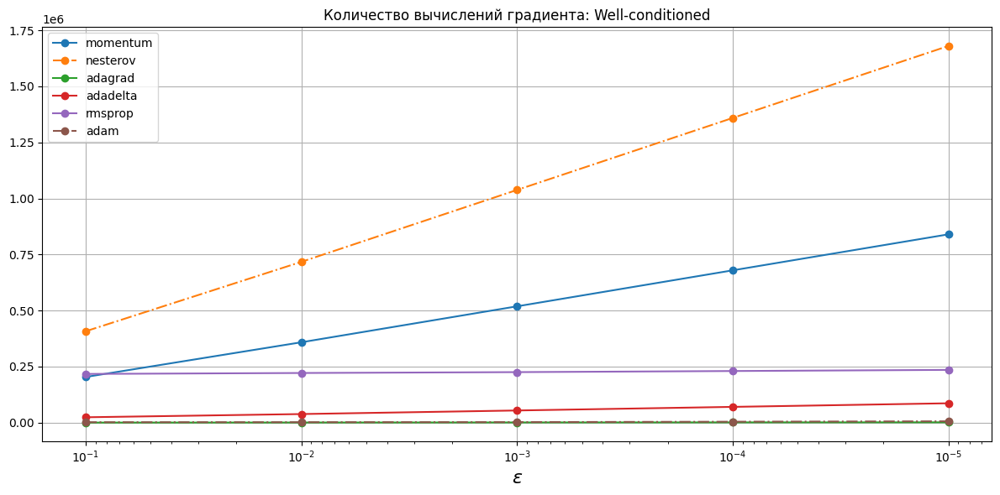

# Зависимости от выбранной точности
Расчеты представлены в [descent.ipynb](descent.ipynb).
Метод AdaDelta реализован по [Matthew D. Zeiler. ADADELTA: An Adaptive Learning Rate Method, 2012](https://arxiv.org/abs/1212.5701)

## Критерий останова

$$\begin{equation}
    \Vert\nabla f(x_k)\Vert < \varepsilon.
\end{equation}$$

## Координаты минимума функции

## Количество итераций

## Количество вычислений градиента

## Приложение с таблицами

<!-- START_X_OPTIM_F_WELL --> 
### Координаты минимума функции: Well-conditioned
|    eps |   momentum (x1) |   momentum (x2) |   nesterov (x1) |   nesterov (x2) |   adagrad (x1) |   adagrad (x2) |   adadelta (x1) |   adadelta (x2) |   rmsprop (x1) |   rmsprop (x2) |    adam (x1) |    adam (x2) |
|-------:|----------------:|----------------:|----------------:|----------------:|---------------:|---------------:|----------------:|----------------:|---------------:|---------------:|-------------:|-------------:|
| 0.1    |    -0.0650609   |     0.0102717   |    -0.0650602   |     0.0102709   |   -0.0287804   |   -0.0287804   |    -0.0592056   |    -0.00226728  |   -0.0302095   |   -0.0283692   | -0.028983    | -0.0271553   |
| 0.01   |    -0.00653433  |     0.00239255  |    -0.00653426  |     0.0023925   |   -0.00288389  |   -0.00288389  |    -0.00659562  |     0.00205626  |   -0.00465148  |   -0.00165685  | -0.00331648  | -0.00162836  |
| 0.001  |    -0.000645875 |     0.0002624   |    -0.000645879 |     0.000262401 |   -0.000286874 |   -0.000286874 |    -0.000647757 |     0.00025707  |   -0.000652465 |    0.000111753 | -0.000538926 |  0.000382628 |
| 0.0001 |    -6.44409e-05 |     2.66089e-05 |    -6.44406e-05 |     2.66088e-05 |   -2.87479e-05 |   -2.87478e-05 |    -6.44652e-05 |     2.65195e-05 |   -6.52574e-05 |    2.40897e-05 | -5.38824e-05 |  3.82555e-05 |
| 1e-05  |    -6.44159e-06 |     2.66684e-06 |    -6.44159e-06 |     2.66684e-06 |   -2.88085e-06 |   -2.88084e-06 |    -6.44056e-06 |     2.66479e-06 |   -6.45459e-06 |    2.62557e-06 | -5.38655e-06 |  3.82435e-06 |
<!-- END_X_OPTIM_F_WELL -->
<!-- START_ITER_COUNT_F_WELL --> 
### Количество итераций: Well-conditioned
|    eps |   momentum |   nesterov |   adagrad |   adadelta |   rmsprop |   adam |
|-------:|-----------:|-----------:|----------:|-----------:|----------:|-------:|
| 0.1    |     203754 |     203758 |       528 |      24188 |    217410 |   2197 |
| 0.01   |     358538 |     358544 |       840 |      38529 |    221617 |   2230 |
| 0.001  |     518864 |     518871 |      1153 |      54493 |    225477 |   2572 |
| 0.0001 |     679372 |     679382 |      1465 |      70543 |    230390 |   4425 |
| 1e-05  |     839886 |     839898 |      1777 |      86596 |    235460 |   6278 |
<!-- END_ITER_COUNT_F_WELL -->
<!-- START_GRAD_COUNT_F_WELL --> 
### Количество вычислений градиента: Well-conditioned
|    eps |   momentum |         nesterov |   adagrad |   adadelta |   rmsprop |   adam |
|-------:|-----------:|-----------------:|----------:|-----------:|----------:|-------:|
| 0.1    |     203754 | 407516           |       528 |      24188 |    217410 |   2197 |
| 0.01   |     358538 | 717088           |       840 |      38529 |    221617 |   2230 |
| 0.001  |     518864 |      1.03774e+06 |      1153 |      54493 |    225477 |   2572 |
| 0.0001 |     679372 |      1.35876e+06 |      1465 |      70543 |    230390 |   4425 |
| 1e-05  |     839886 |      1.6798e+06  |      1777 |      86596 |    235460 |   6278 |
<!-- END_GRAD_COUNT_F_WELL -->
<!-- START_X_OPTIM_F_POOR --> 
### Координаты минимума функции: Poorly-conditioned
|    eps |   momentum (x1) |   momentum (x2) |   nesterov (x1) |   nesterov (x2) |   adagrad (x1) |   adagrad (x2) |   adadelta (x1) |   adadelta (x2) |   rmsprop (x1) |   rmsprop (x2) |   adam (x1) |   adam (x2) |
|-------:|----------------:|----------------:|----------------:|----------------:|---------------:|---------------:|----------------:|----------------:|---------------:|---------------:|------------:|------------:|
| 0.1    |        -5.49285 |       -0.207137 |        -5.49285 |       -0.207137 |       -5.49648 |      -0.207104 |        -5.49286 |       -0.207137 |       -5.49286 |      -0.207141 |    -5.50068 |   -0.207501 |
| 0.01   |        -5.51682 |       -0.207727 |        -5.51682 |       -0.207727 |       -5.51718 |      -0.207723 |        -5.51682 |       -0.207727 |       -5.51682 |      -0.207727 |    -5.51761 |   -0.207763 |
| 0.001  |        -5.51921 |       -0.207786 |        -5.51921 |       -0.207786 |       -5.51925 |      -0.207785 |        -5.51921 |       -0.207786 |       -5.51921 |      -0.207786 |    -5.51929 |   -0.207789 |
| 0.0001 |        -5.51945 |       -0.207792 |        -5.51945 |       -0.207792 |       -5.51946 |      -0.207792 |        -5.51945 |       -0.207792 |       -5.51945 |      -0.207792 |    -5.51946 |   -0.207792 |
| 1e-05  |        -5.51948 |       -0.207792 |        -5.51948 |       -0.207792 |       -5.51948 |      -0.207792 |        -5.51948 |       -0.207792 |       -5.51948 |      -0.207792 |    -5.51948 |   -0.207792 |
<!-- END_X_OPTIM_F_POOR -->
<!-- START_ITER_COUNT_F_POOR --> 
### Количество итераций: Poorly-conditioned
|    eps |   momentum |   nesterov |   adagrad |   adadelta |   rmsprop |   adam |
|-------:|-----------:|-----------:|----------:|-----------:|----------:|-------:|
| 0.1    |     128100 |     128105 |      2716 |      25603 |    329459 | 105063 |
| 0.01   |     189417 |     189424 |      4201 |      31735 |    332690 | 105589 |
| 0.001  |     250735 |     250744 |      5687 |      37868 |    334650 | 105963 |
| 0.0001 |     312052 |     312064 |      7172 |      44001 |    336589 | 106335 |
| 1e-05  |     373370 |     373384 |      8658 |      50134 |    338527 | 106707 |
<!-- END_ITER_COUNT_F_POOR -->
<!-- START_GRAD_COUNT_F_POOR --> 
### Количество вычислений градиента: Poorly-conditioned
|    eps |   momentum |   nesterov |   adagrad |   adadelta |   rmsprop |   adam |
|-------:|-----------:|-----------:|----------:|-----------:|----------:|-------:|
| 0.1    |     128100 |     256210 |      2716 |      25603 |    329459 | 105063 |
| 0.01   |     189417 |     378848 |      4201 |      31735 |    332690 | 105589 |
| 0.001  |     250735 |     501488 |      5687 |      37868 |    334650 | 105963 |
| 0.0001 |     312052 |     624128 |      7172 |      44001 |    336589 | 106335 |
| 1e-05  |     373370 |     746768 |      8658 |      50134 |    338527 | 106707 |
<!-- END_GRAD_COUNT_F_POOR -->
<!-- START_X_OPTIM_F_ROZEN --> 
### Координаты минимума функции: Rosenbrock
|    eps |   momentum (x1) |   momentum (x2) |   nesterov (x1) |   nesterov (x2) |   adagrad (x1) |   adagrad (x2) |   adadelta (x1) |   adadelta (x2) |   rmsprop (x1) |   rmsprop (x2) |   adam (x1) |   adam (x2) |
|-------:|----------------:|----------------:|----------------:|----------------:|---------------:|---------------:|----------------:|----------------:|---------------:|---------------:|------------:|------------:|
| 0.1    |        0.897282 |        0.804678 |        0.897282 |        0.804678 |       0.909654 |       0.827208 |        0.897289 |        0.80469  |       0.901796 |       0.812746 |    0.959538 |    0.920333 |
| 0.01   |        0.988919 |        0.977916 |        0.988919 |        0.977916 |       0.990325 |       0.980715 |        0.988919 |        0.977917 |       0.988921 |       0.977921 |    0.995739 |    0.991458 |
| 0.001  |        0.998883 |        0.997763 |        0.998883 |        0.997763 |       0.999025 |       0.998049 |        0.998883 |        0.997763 |       0.998883 |       0.997763 |    0.999571 |    0.999139 |
| 0.0001 |        0.999888 |        0.999776 |        0.999888 |        0.999776 |       0.999902 |       0.999805 |        0.999888 |        0.999776 |       0.999888 |       0.999776 |    0.999957 |    0.999914 |
| 1e-05  |        0.999989 |        0.999978 |        0.999989 |        0.999978 |       0.99999  |       0.99998  |        0.999989 |        0.999978 |       0.999989 |       0.999978 |    0.999996 |    0.999991 |
<!-- END_X_OPTIM_F_ROZEN -->
<!-- START_ITER_COUNT_F_ROZEN --> 
### Количество итераций: Rosenbrock
|    eps |         momentum |         nesterov |          adagrad |   adadelta |   rmsprop |   adam |
|-------:|-----------------:|-----------------:|-----------------:|-----------:|----------:|-------:|
| 0.1    | 311412           | 311459           | 483955           |      50295 |    326980 |  11558 |
| 0.01   | 833358           | 833408           |      1.04887e+06 |     102490 |    350649 |  12676 |
| 0.001  |      1.40393e+06 |      1.40398e+06 |      1.65114e+06 |     159548 |    368821 |  13549 |
| 0.0001 |      1.97987e+06 |      1.97992e+06 |      2.25751e+06 |     217144 |    387035 |  14424 |
| 1e-05  |      2.55636e+06 |      2.55641e+06 |      2.86428e+06 |     274793 |    405265 |  15300 |
<!-- END_ITER_COUNT_F_ROZEN -->
<!-- START_GRAD_COUNT_F_ROZEN --> 
### Количество вычислений градиента: Rosenbrock
|    eps |         momentum |         nesterov |          adagrad |   adadelta |   rmsprop |   adam |
|-------:|-----------------:|-----------------:|-----------------:|-----------:|----------:|-------:|
| 0.1    | 311412           | 622918           | 483955           |      50295 |    326980 |  11558 |
| 0.01   | 833358           |      1.66682e+06 |      1.04887e+06 |     102490 |    350649 |  12676 |
| 0.001  |      1.40393e+06 |      2.80796e+06 |      1.65114e+06 |     159548 |    368821 |  13549 |
| 0.0001 |      1.97987e+06 |      3.95985e+06 |      2.25751e+06 |     217144 |    387035 |  14424 |
| 1e-05  |      2.55636e+06 |      5.11282e+06 |      2.86428e+06 |     274793 |    405265 |  15300 |
<!-- END_GRAD_COUNT_F_ROZEN -->