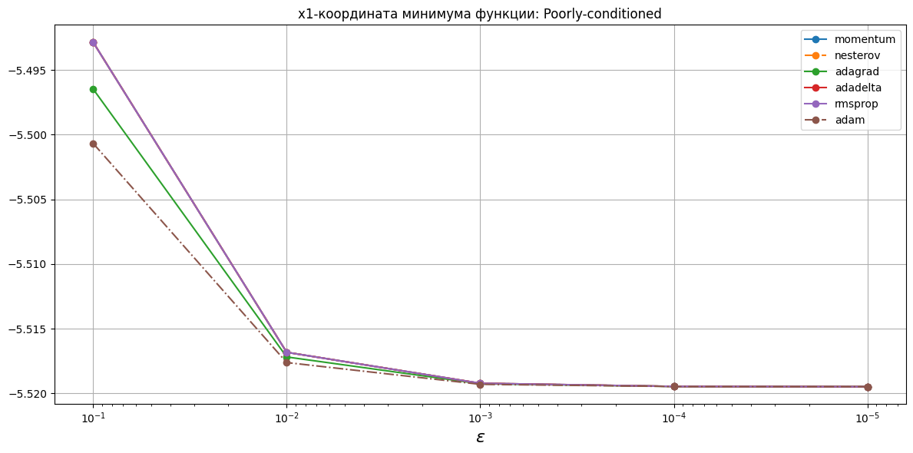
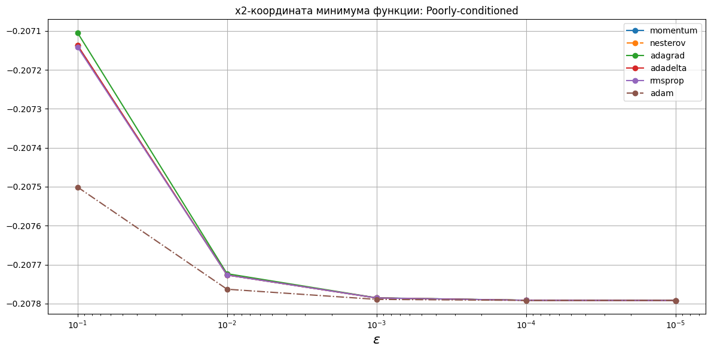
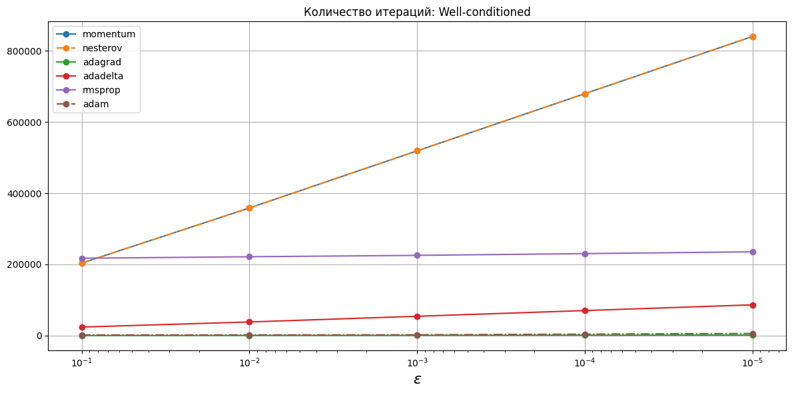

# Зависимости от выбранной точности
Расчеты представлены в [descent.ipynb](descent.ipynb).
Метод AdaDelta реализован по [Matthew D. Zeiler. ADADELTA: An Adaptive Learning Rate Method. 2012](https://arxiv.org/abs/1212.5701)

## Критерий останова

$$\begin{equation}
    \Vert\nabla f(x_k)\Vert < \varepsilon.
\end{equation}$$

## Координаты минимума функции

## Количество итераций

## Количество вычислений градиента

## Приложение с таблицами
