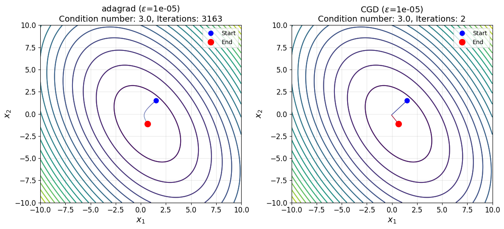
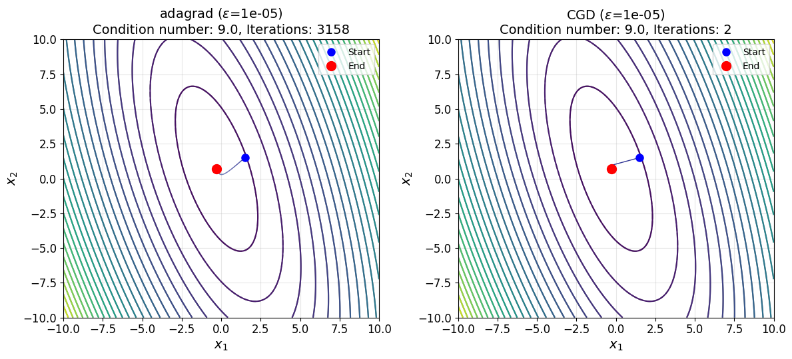
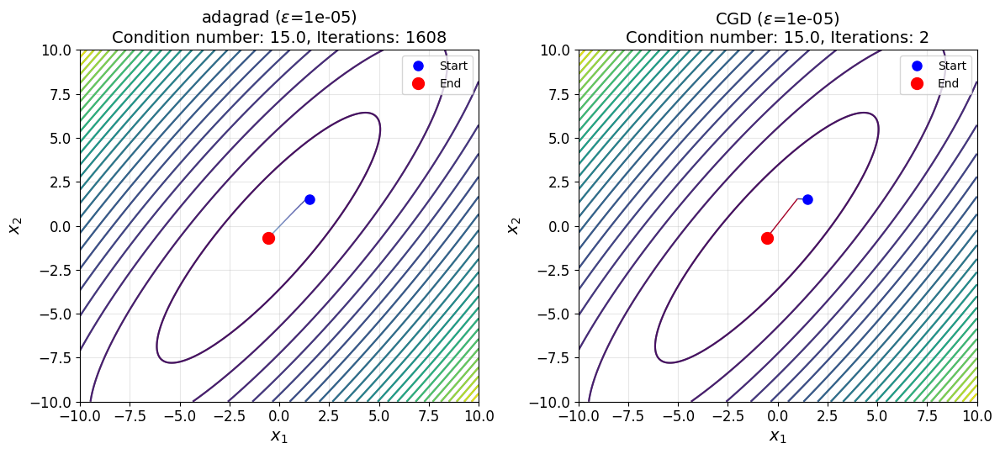
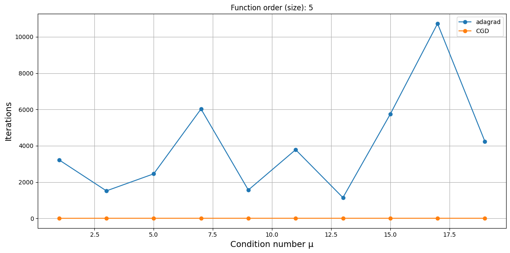
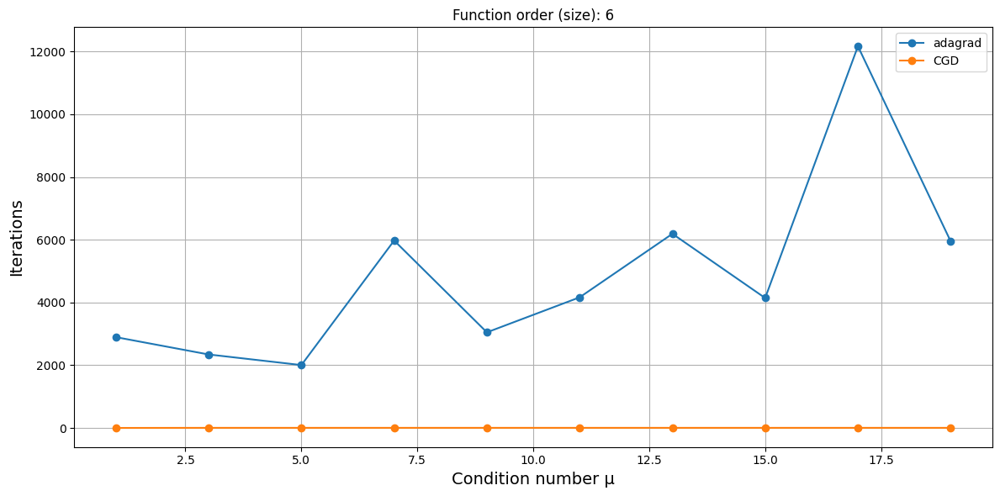

# Исследование зависимости от заданной размерности и числа обусловленности квадратичных функций
Расчеты представлены в [general_function_optimization.ipynb](general_function_optimization.ipynb).

## Критерий останова

$$\begin{equation}
    \Vert\nabla f(x_k)\Vert < 1e-5.
\end{equation}$$

## Траектории

## Количество итераций

## Приложение с таблицами

<!-- START_ADAM --> 
### adam: Количество итераций ($\epsilon$=1e-05)
|   µ |   order=2 |   order=3 |   order=4 |   order=5 |   order=6 |   order=7 |   order=8 |   order=9 |   order=10 |   order=11 |
|----:|----------:|----------:|----------:|----------:|----------:|----------:|----------:|----------:|-----------:|-----------:|
|   1 |       584 |      2475 |       832 |      1695 |      5028 |      4533 |      2768 |      2323 |       4497 |       5075 |
|   3 |      1006 |      1617 |      1126 |      1058 |      2460 |      2643 |      1173 |      2477 |       1792 |       1791 |
|   5 |       710 |      4050 |      3232 |      2286 |      3292 |      2119 |      2312 |      1961 |       1897 |       2437 |
|   7 |      6808 |      1516 |      2402 |      3009 |      2641 |      3228 |      2672 |      2469 |       2374 |       1977 |
|   9 |      4247 |      4349 |      3200 |      1482 |      4832 |      3411 |      4011 |      2869 |       6195 |       5123 |
|  11 |      8159 |       740 |      4555 |      3814 |      4329 |      3639 |      4151 |      5008 |       2457 |       5188 |
|  13 |      6201 |      6560 |      3839 |      1972 |      6268 |      3979 |      4858 |      2094 |       6434 |       9104 |
|  15 |      1577 |      1886 |      1130 |      2666 |      5822 |      5392 |      6206 |      4662 |       6483 |       7993 |
|  17 |      1560 |      1554 |      1995 |      8542 |      8918 |      3124 |      3651 |      8594 |       5575 |       4182 |
|  19 |      1845 |     14482 |       950 |      6261 |     11848 |      7622 |      2552 |      9710 |       5844 |       7474 |
<!-- END_ADAM -->

<!-- START_ADAGRAD --> 
### adagrad: Количество итераций ($\epsilon$=1e-05)
|   µ |   order=2 |   order=3 |   order=4 |   order=5 |   order=6 |   order=7 |   order=8 |   order=9 |   order=10 |   order=11 |
|----:|----------:|----------:|----------:|----------:|----------:|----------:|----------:|----------:|-----------:|-----------:|
|   1 |      1593 |      2710 |      4690 |      3220 |      2896 |      2255 |      7476 |      5438 |       2496 |       2175 |
|   3 |      3163 |      2400 |      2232 |      1514 |      2344 |      2277 |      2499 |      2986 |       3131 |       1538 |
|   5 |      1100 |      3024 |      2938 |      2452 |      2006 |      1937 |      3236 |      2464 |       2553 |       3080 |
|   7 |      2260 |      2101 |      2341 |      6026 |      5974 |      3418 |      3762 |      3255 |       5170 |       2567 |
|   9 |      3158 |      1858 |      1853 |      1561 |      3049 |      1671 |      4637 |      3699 |       4334 |       2866 |
|  11 |      5615 |       892 |      1954 |      3782 |      4165 |      1605 |      5543 |      2073 |       5077 |       5888 |
|  13 |      1041 |     11563 |      4057 |      1142 |      6189 |      3278 |      4670 |      6734 |       4482 |       6076 |
|  15 |      1608 |      7774 |      5690 |      5739 |      4143 |      4026 |      3293 |      3311 |       3889 |       8951 |
|  17 |      1198 |      2479 |      4835 |     10731 |     12165 |      3263 |     10756 |     12697 |       7831 |       2896 |
|  19 |      2934 |      8991 |      1508 |      4243 |      5948 |      3160 |      9065 |      5582 |       8544 |       3789 |
<!-- END_ADAGRAD -->
<!-- START_CGD --> 
### CGD: Количество итераций ($\epsilon$=1e-05)
|   µ |   order=2 |   order=3 |   order=4 |   order=5 |   order=6 |   order=7 |   order=8 |   order=9 |   order=10 |   order=11 |
|----:|----------:|----------:|----------:|----------:|----------:|----------:|----------:|----------:|-----------:|-----------:|
|   1 |         1 |         2 |         2 |         3 |         3 |         3 |         3 |         3 |          3 |          3 |
|   3 |         2 |         3 |         4 |         5 |         6 |         7 |         7 |         7 |          8 |          8 |
|   5 |         2 |         3 |         4 |         5 |         6 |         7 |         8 |         8 |         10 |         11 |
|   7 |         2 |         3 |         4 |         5 |         6 |         7 |         8 |         9 |         10 |         10 |
|   9 |         2 |         3 |         4 |         5 |         6 |         7 |         8 |         9 |         10 |         10 |
|  11 |         2 |         3 |         4 |         5 |         6 |         7 |         8 |         9 |         10 |         11 |
|  13 |         2 |         3 |         4 |         5 |         6 |         7 |         8 |         9 |         10 |         11 |
|  15 |         2 |         3 |         4 |         5 |         6 |         7 |         8 |         9 |         10 |         11 |
|  17 |         2 |         3 |         4 |         5 |         6 |         7 |         8 |         9 |         10 |         11 |
|  19 |         2 |         3 |         4 |         5 |         6 |         7 |         8 |         9 |         10 |         11 |
<!-- END_CGD -->