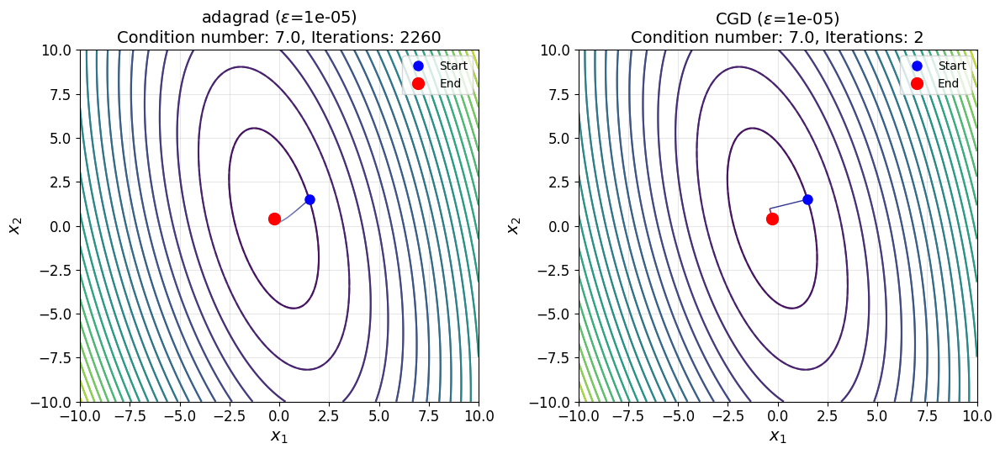
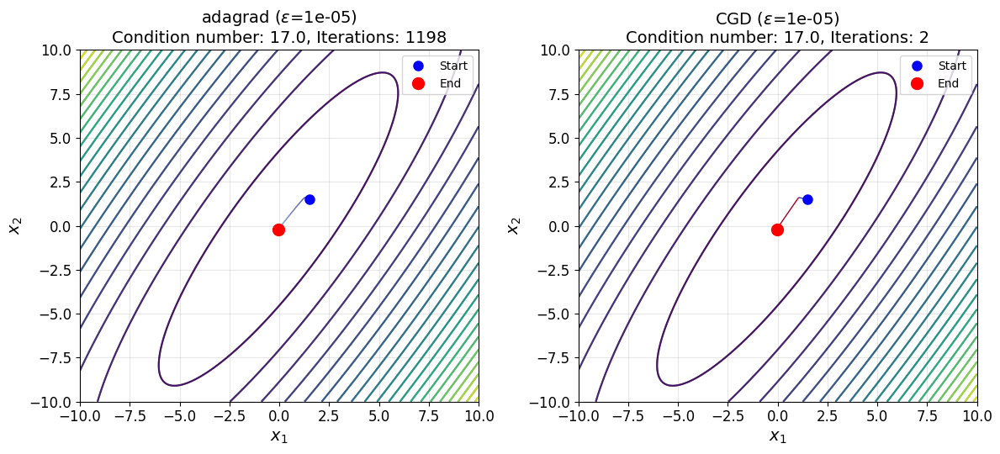

# Исследование зависимости от заданной размерности и числа обусловленности квадратичных функций
Расчеты представлены в [general_function_optimization.ipynb](general_function_optimization.ipynb).

## Критерий останова

$$\begin{equation}
    \Vert\nabla f(x_k)\Vert < 1e-5.
\end{equation}$$

## Траектории

## Количество итераций

## Приложение с таблицами

<!-- START_ADAM --> 
### adam: Количество итераций ($\epsilon$=1e-05)
|   µ |   order=2 |   order=3 |   order=4 |   order=5 |   order=6 |   order=7 |   order=8 |   order=9 |   order=10 |   order=11 |
|----:|----------:|----------:|----------:|----------:|----------:|----------:|----------:|----------:|-----------:|-----------:|
|   1 |      3400 |      2395 |      2198 |      3129 |      3349 |      2324 |      3411 |      3259 |       3365 |       2831 |
|   3 |      2625 |      1097 |      3419 |      1998 |      1892 |      2619 |      1986 |      1978 |       2752 |       2656 |
|   5 |      2055 |      1924 |      1683 |      2756 |      2419 |      2826 |      2353 |      2570 |       2508 |       2866 |
|   7 |      1656 |      2419 |      2498 |      2346 |      2359 |      3224 |      2410 |      2460 |       2874 |       3313 |
|   9 |      2541 |      2153 |      2157 |      2024 |      2738 |      2063 |      2685 |      2702 |       2748 |       2797 |
|  11 |      2851 |      1861 |      2446 |      2715 |      2753 |      2183 |      2305 |      2021 |       2182 |       2594 |
|  13 |      2100 |      1929 |      1977 |      1991 |      2334 |      2907 |      2149 |      2348 |       2311 |       2183 |
|  15 |      2108 |      1979 |      2143 |      2721 |      2282 |      2404 |      2271 |      2145 |       3866 |       2148 |
|  17 |      1087 |      2790 |      2432 |      2356 |      2549 |      2475 |      2408 |      2214 |       2080 |       2042 |
|  19 |      2019 |      2211 |      2416 |      2032 |      2684 |      2479 |      2497 |      3020 |       2168 |       2103 |
<!-- END_ADAM -->
<!-- START_CGD --> 
### CGD: Количество итераций ($\epsilon$=1e-05)
|   µ |   order=2 |   order=3 |   order=4 |   order=5 |   order=6 |   order=7 |   order=8 |   order=9 |   order=10 |   order=11 |
|----:|----------:|----------:|----------:|----------:|----------:|----------:|----------:|----------:|-----------:|-----------:|
|   1 |         1 |         2 |         2 |         3 |         3 |         3 |         3 |         3 |          3 |          3 |
|   3 |         2 |         3 |         4 |         5 |         6 |         7 |         8 |         8 |          9 |          9 |
|   5 |         2 |         3 |         4 |         5 |         6 |         7 |         8 |         9 |          9 |          9 |
|   7 |         2 |         3 |         4 |         5 |         6 |         7 |         8 |         9 |         10 |         10 |
|   9 |         2 |         3 |         4 |         5 |         6 |         7 |         8 |         9 |         10 |         10 |
|  11 |         2 |         3 |         4 |         5 |         6 |         7 |         8 |         9 |         10 |         11 |
|  13 |         2 |         3 |         4 |         5 |         6 |         7 |         8 |         9 |         10 |         11 |
|  15 |         2 |         3 |         4 |         5 |         6 |         7 |         8 |         9 |         10 |         11 |
|  17 |         2 |         3 |         4 |         5 |         6 |         7 |         8 |         9 |         10 |         11 |
|  19 |         2 |         3 |         4 |         5 |         6 |         7 |         8 |         9 |         10 |         10 |
<!-- END_CGD -->