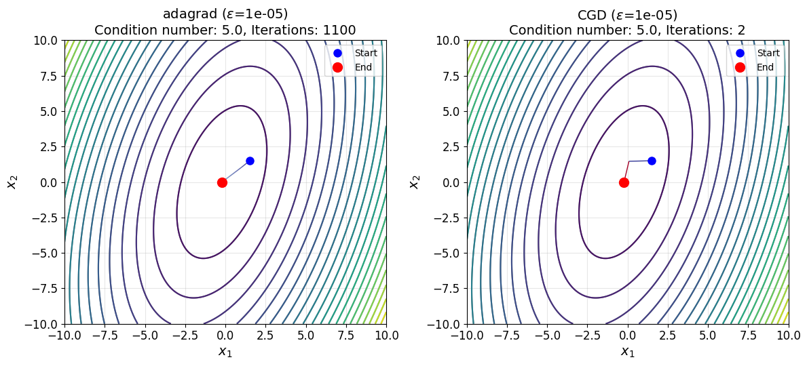
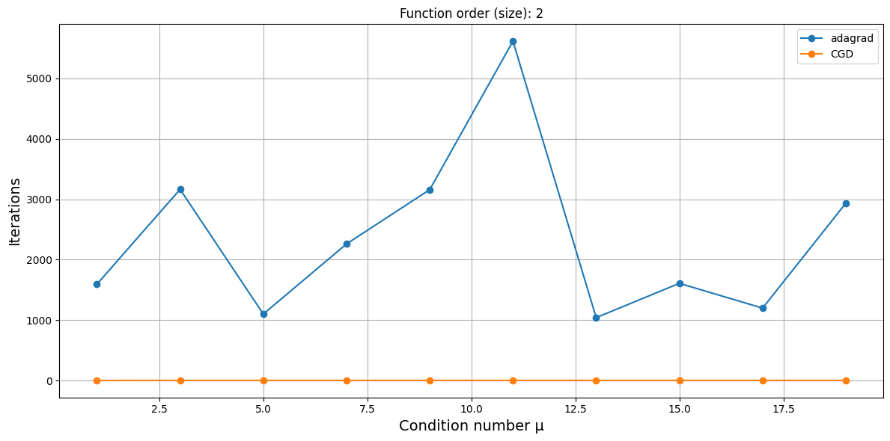

# Исследование зависимости от заданной размерности и числа обусловленности квадратичных функций
Расчеты представлены в [general_function_optimization.ipynb](general_function_optimization.ipynb).

## Критерий останова

$$\begin{equation}
    \Vert\nabla f(x_k)\Vert < 1e-5.
\end{equation}$$

## Траектории

## Количество итераций

## Приложение с таблицами

<!-- START_ARMIJO_GRAD_DESCENT --> 
### armijo_grad_descent: Количество итераций ($\epsilon$=1e-05)
|   µ |   order=2 |   order=3 |   order=4 |   order=5 |   order=6 |   order=7 |   order=8 |   order=9 |   order=10 |   order=11 |
|----:|----------:|----------:|----------:|----------:|----------:|----------:|----------:|----------:|-----------:|-----------:|
|   1 |         1 |        19 |         3 |        19 |         3 |         3 |        19 |         3 |         12 |          3 |
|   3 |        16 |        18 |        20 |        18 |        18 |        19 |        18 |        19 |         17 |         18 |
|   5 |        26 |        28 |        26 |        25 |        26 |        27 |        27 |        25 |         24 |         26 |
|   7 |        43 |        41 |        40 |        33 |        44 |        33 |        40 |        44 |         39 |         31 |
|   9 |        32 |        33 |        32 |        32 |        33 |        34 |        33 |        33 |         33 |         32 |
|  11 |        58 |        50 |        59 |        60 |        49 |        55 |        61 |        58 |         63 |         56 |
|  13 |        56 |        53 |        53 |        57 |        52 |        53 |        57 |        59 |         56 |         58 |
|  15 |        84 |        70 |        78 |        45 |        60 |        60 |        54 |        87 |         45 |         58 |
|  17 |        35 |        41 |        44 |        40 |        50 |        48 |        43 |        52 |         48 |         53 |
|  19 |        65 |        72 |        75 |        70 |        73 |        71 |        55 |        73 |         73 |         67 |
<!-- END_ARMIJO_GRAD_DESCENT -->
<!-- START_CONJUGATE_GRAD_DESCENT --> 
### conjugate_grad_descent: Количество итераций ($\epsilon$=1e-05)
|   µ |   order=2 |   order=3 |   order=4 |   order=5 |   order=6 |   order=7 |   order=8 |   order=9 |   order=10 |   order=11 |
|----:|----------:|----------:|----------:|----------:|----------:|----------:|----------:|----------:|-----------:|-----------:|
|   1 |         1 |         2 |         2 |         3 |         3 |         3 |         3 |         3 |          3 |          3 |
|   3 |         2 |         3 |         4 |         5 |         6 |         7 |         8 |         8 |          9 |          9 |
|   5 |         2 |         3 |         4 |         5 |         6 |         7 |         8 |         9 |         10 |         11 |
|   7 |         2 |         3 |         4 |         5 |         6 |         7 |         8 |         9 |         10 |         11 |
|   9 |         2 |         3 |         4 |         5 |         6 |         7 |         8 |         9 |          9 |         11 |
|  11 |         2 |         3 |         4 |         5 |         6 |         7 |         8 |         9 |         10 |         11 |
|  13 |         2 |         3 |         4 |         5 |         6 |         7 |         8 |         9 |         10 |         11 |
|  15 |         2 |         3 |         4 |         5 |         6 |         7 |         8 |         9 |         10 |         11 |
|  17 |         2 |         3 |         4 |         5 |         6 |         7 |         8 |         9 |         10 |         11 |
|  19 |         2 |         3 |         4 |         5 |         6 |         7 |         8 |         9 |         10 |         11 |
<!-- END_CONJUGATE_GRAD_DESCENT -->