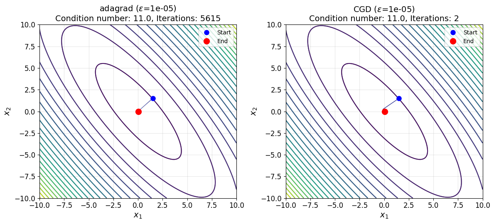
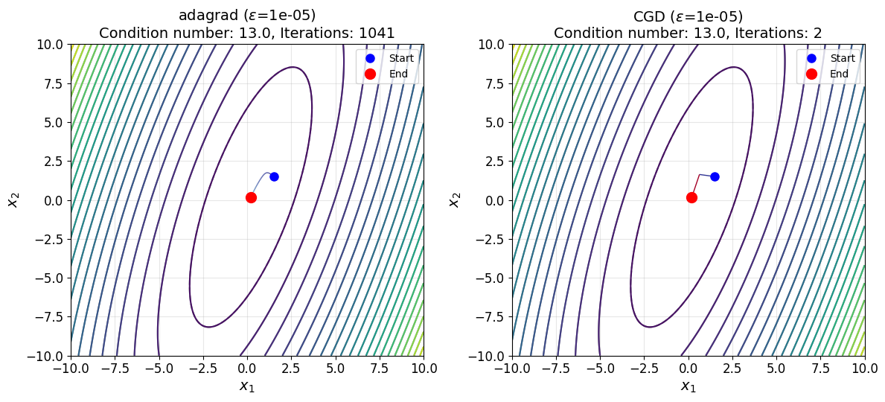
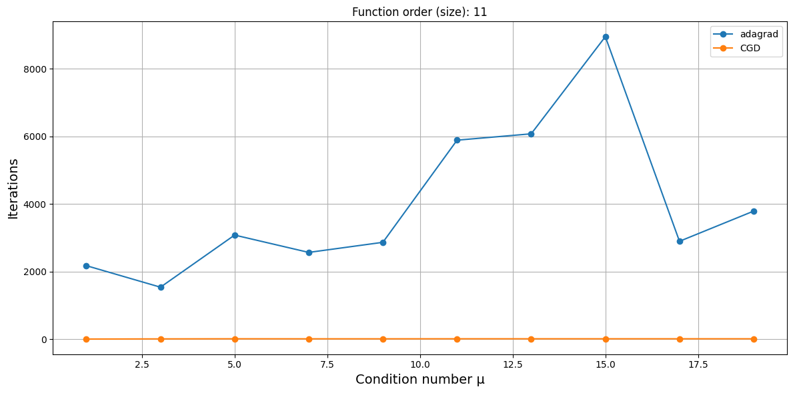

# Исследование зависимости от заданной размерности и числа обусловленности квадратичных функций
Расчеты представлены в [general_function_optimization.ipynb](general_function_optimization.ipynb).

## Критерий останова

$$\begin{equation}
    \Vert\nabla f(x_k)\Vert < 1e-5.
\end{equation}$$

## Траектории

## Количество итераций

## Приложение с таблицами

<!-- START_ADAM --> 
### adam: Количество итераций ($\epsilon$=1e-05)
|   µ |   order=2 |   order=3 |   order=4 |   order=5 |   order=6 |   order=7 |   order=8 |   order=9 |   order=10 |   order=11 |
|----:|----------:|----------:|----------:|----------:|----------:|----------:|----------:|----------:|-----------:|-----------:|
|   1 |     21455 |     27369 |     50708 |     38802 |     41239 |     51994 |     38990 |     55714 |      50426 |      39197 |
|   3 |      8549 |     32346 |     20740 |     19974 |     31498 |     42248 |     29953 |     25019 |      35426 |      25357 |
|   5 |     11561 |     15073 |     32493 |     21242 |     35348 |     22714 |     15803 |     27828 |      23945 |      25605 |
|   7 |     22457 |     34971 |     15267 |     12920 |     13402 |     15844 |     15685 |     28590 |      22402 |      17764 |
|   9 |     21625 |      5620 |     17662 |     21314 |     33203 |     21787 |     23880 |     16661 |      13697 |      20145 |
|  11 |     62189 |     16393 |     33842 |     16826 |     12274 |     13897 |     18456 |     27945 |      16444 |      19794 |
|  13 |     37242 |      9528 |     51013 |     22630 |     13642 |      7351 |     23151 |     17687 |      20567 |      12993 |
|  15 |     52949 |     27197 |     10799 |     10289 |     16370 |     26337 |     21622 |     26970 |      14431 |      17519 |
|  17 |     35405 |      6840 |     24929 |     25109 |     27092 |     29236 |     12615 |     11680 |      24126 |      12583 |
|  19 |     17044 |     34731 |     15306 |     27597 |     15327 |     10134 |     13984 |     15976 |      32907 |      10679 |
<!-- END_ADAM -->
<!-- START_CGD --> 
### CGD: Количество итераций ($\epsilon$=1e-05)
|   µ |   order=2 |   order=3 |   order=4 |   order=5 |   order=6 |   order=7 |   order=8 |   order=9 |   order=10 |   order=11 |
|----:|----------:|----------:|----------:|----------:|----------:|----------:|----------:|----------:|-----------:|-----------:|
|   1 |         1 |         2 |         3 |         3 |         3 |         3 |         3 |         3 |          3 |          3 |
|   3 |         2 |         3 |         4 |         5 |         6 |         7 |         8 |         8 |          8 |          8 |
|   5 |         2 |         3 |         4 |         5 |         6 |         7 |         8 |         9 |         10 |         10 |
|   7 |         2 |         3 |         4 |         5 |         6 |         7 |         8 |         9 |         10 |         10 |
|   9 |         2 |         3 |         4 |         5 |         6 |         7 |         8 |         9 |         10 |         11 |
|  11 |         2 |         3 |         4 |         5 |         6 |         7 |         8 |         9 |         10 |         10 |
|  13 |         2 |         3 |         4 |         5 |         6 |         7 |         8 |         9 |         10 |         11 |
|  15 |         2 |         3 |         4 |         5 |         6 |         7 |         8 |         9 |         10 |         11 |
|  17 |         2 |         3 |         4 |         5 |         6 |         7 |         8 |         8 |         10 |         11 |
|  19 |         2 |         3 |         4 |         5 |         6 |         7 |         8 |         9 |         10 |         11 |
<!-- END_CGD -->